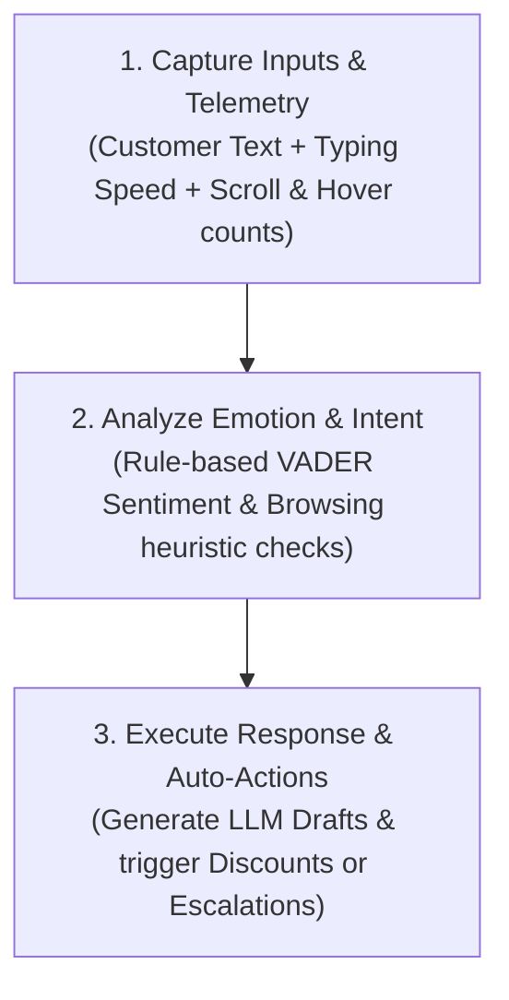

# 🤖 AI Customer Emotion & Intent Predictor

An explainable, real-time customer care bot that analyzes visitor behavior (scrolls/hover) and message text to predict customer emotion and intent, generating tailored AI support responses and automated actions.

---

## 🏆 Hackathon Details
* **Category**: Support Chat Bot / Customer Care Bot
* **Author**: Sai Charan (Hyderabad, India)

---

## ✨ Key Features

* **🎭 Emotion Detection (Text + Telemetry)**: Combines TextBlob and NLTK VADER sentiment analysis with physical typing speed to classify customer mood as `HAPPY`, `NEUTRAL`, `FRUSTRATED`, or `ANGRY`.
* **🔮 Behavioral Intent Prediction**: Predicts intent (e.g., `READY_TO_BUY`) based on browser interaction metrics (scrolling and hover times) *before* the customer even finishes typing their message.
* **✍️ Emotion-Matched AI Responses**: Utilizes structured LangChain prompts to draft customer support responses matching the customer's exact emotional state and transaction intent.
* **⚡ Proactive Auto-Actions**: Automatically recommends system workflows based on customer status—such as issuing a `DISCOUNT` coupon for hesitant buyers, escalating to human managers (`ESCALATE`), or initiating a refund (`AUTO_RETURN`).
* **💻 Interactive Streamlit Web UI**: A glassmorphic, responsive developer dashboard to easily test inputs, adjust behavior values, and view the live conversation log.

---

## ⚙️ How It Works



---

## 🛠️ Tech Stack

| Technology / Library | Purpose |
| :--- | :--- |
| **Streamlit** | Interactive front-end web dashboard and chat UI |
| **LangChain** | LLM orchestration and prompt template management |
| **OpenAI GPT-4o-mini** | Generates precise, emotion-aware customer responses |
| **NLTK VADER** | Rule-based lexicon analysis for emotional sentiment classification |
| **TextBlob** | NLP processing and baseline sentiment polarity estimation |
| **Python 3.10+** | Core programming language environment |

---

## 🚀 Installation

Ensure you have Python 3.10 or newer installed. Set up your environment with the following commands:

1. **Clone the repository** and navigate into the project folder:
   ```bash
   cd ai-customer-emotion-intent-predictor
   ```

2. **Create and activate a virtual environment**:
   ```bash
   # Windows PowerShell
   python -m venv .venv
   .\.venv\Scripts\Activate.ps1

   # macOS/Linux
   python3 -m venv .venv
   source .venv/bin/activate
   ```

3. **Install the dependencies**:
   ```bash
   python -m pip install -r requirements.txt
   ```

4. **Download NLTK VADER lexicon data**:
   ```bash
   python -m nltk.downloader vader_lexicon
   ```

---

## 💻 Usage

1. **Set your OpenAI API Key** (Optional - if omitted, the app runs in Local Fallback Offline Mode using pre-configured templates):
   ```bash
   # Windows PowerShell
   $env:OPENAI_API_KEY = "your-api-key"

   # macOS/Linux
   export OPENAI_API_KEY="your-api-key"
   ```

2. **Start the Streamlit application**:
   ```bash
   python -m streamlit run app.py
   ```

3. Open `http://localhost:8501` in your browser.

---

## 🎬 Demo Guide (What to Showcase in a Video)

When recording a demo video for this hackathon project, show the following scenarios:

1. **The Hesitant Buyer (Proactive Discount)**:
   - Input message: *"I really like this product."*
   - Change **Scrolls** to `3` and **Hover (s)** to `6.0`.
   - Send the message. Show that the bot identifies the intent as `READY_TO_BUY` and automatically issues a **₹200 discount code** (`DISCOUNT` action).
2. **The Angry Customer (Priority Escalation)**:
   - Input message: *"THIS IS UNACCEPTABLE! My order still hasn't arrived!"*
   - Keep Scrolls and Hover at `0`.
   - Send the message. Show that the bot identifies the emotion as `ANGRY` and the intent as `COMPLAINT`, triggering an **`ESCALATE`** action to route the user immediately to a human manager.
3. **The Return Request (Auto-Refund)**:
   - Click the **Try Demo Examples** button to show a batch run of all scenarios, showing how a return query automatically launches the **`AUTO_RETURN`** workflow.
